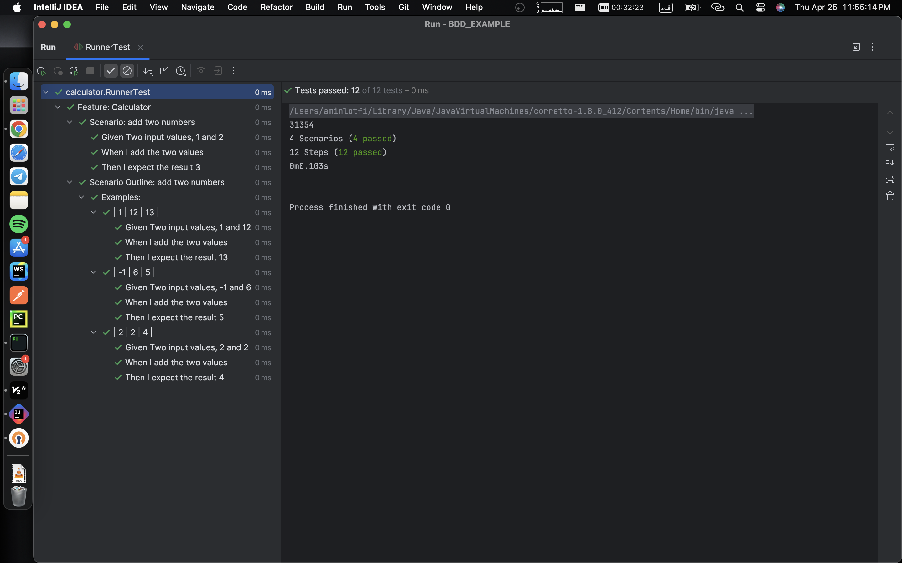

# مثالی از تبدیل نیازمندی‌ها به موارد آزمون با استفاده از روش ایجاد مبتنی بر رفتار (BDD)

## مشکل undefined برخی تست‌ها

### این موارد تست کدامند؟
این موارد تست سناریوهایی هستند که تعاریف متناظر برای آن‌ها در فایل MyStepdefs.java وجود ندارد. به عبارت دیگر، این سناریوها با مراحل مشخص شده در کد جاوا تطابق ندارند. به عنوان مثال، سناریویی که ورودی‌هایش با تعاریف متناظر در فایل MyStepdefs.java تطابق ندارد، به مشکل undefined برخورد می‌کند.

### علت بروز مشکل چیست؟
به دلیل عدم پشتیبانی از اعداد منفی در فایل MyStepdefs.java و تنها پشتیبانی از اعداد مثبت، مشکل بوجود آمد. وقتی یک عدد منفی وارد می‌شود، تعریف متناظر در فایل MyStepdefs.java پیدا نمی‌شود و به عبارت دیگر، تست به وضعیت undefined درمی‌آمد.

### علت بروز مشکل و نحوه رفع آن را توضیح دهید
مشکل اصلی این بود که نمونه‌هایی که شامل اعداد منفی بودند به وضعیت undefined برخورد می‌کردند، زیرا تعاریف متناظر آن‌ها در فایل MyStepdefs.java وجود نداشت. برای حل این مشکل،  پشتیبانی از اعداد منفی برای هر دو عدد اول و دوم را اضافه کردم. با اعمال تغییراتی به کد وبا استفاده از عبارات منظم (regEX) و تغییر از (\\d+)  به‌ (-?\\d+)، اعداد منفی نیز در نظر گرفته شدند و تمامی تست‌ها با موفقیت اجرا شدند.

## پاس شدن ‌همه‌ی سناریوهای تست
